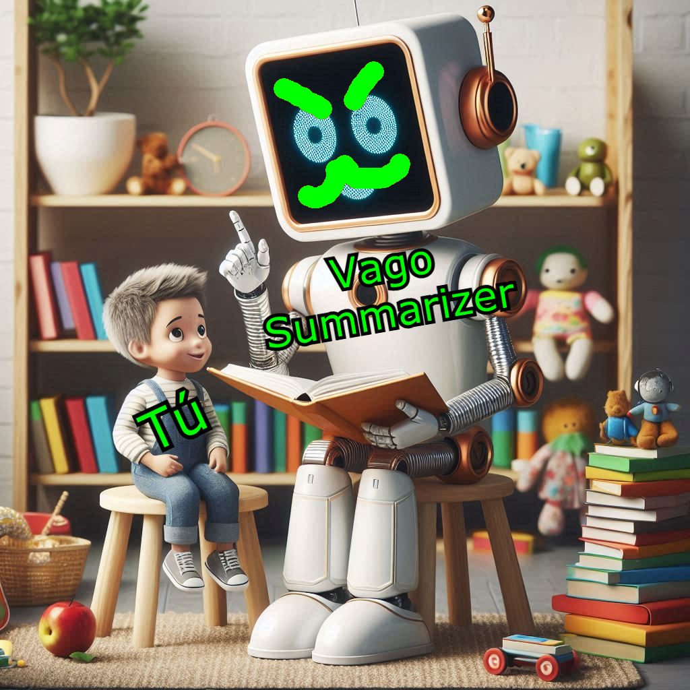

<p align="center"><a href="" target="_blank"></a></p>

# Vago Summarizer

Vago Summarizer is a Python-based application that processes youtube videos and video files to generate markdown summaries. It uses the [ollama API](https://github.com/ollama/ollama/blob/main/docs/api.md#generate-a-completion) to access local LLMs to summarize videos into markdown format.

## Example

This is the transcription of a game theory course from Coursera:

*One, two, three. One, two, three. One, two, three. Hey guys, what are you doing? Oh, hello, I've got a friend over here. Who are you? I'm Kevin. Oh, nice, I'm Yov. I'm Matt. I guess we ought to play a new game, huh? Um... What do you suggest? Ah, how about some Blackjack? I could do that. I don't have an office. I'm in office, so let's play for low stakes, okay? Like $10,000? Oh, it's a deal. Alright. Let's see who wins. Oh, here, here, here. Hey, HIPP. Do you want a card? What are the rules again? Uh, well, you try and get to 21. Anybody gets to 21? Uh, wins. If you go over 21, you're going to lose. Oh, I see. I don't know. I guess I'll save what I have. I'm going to take one more. Ah, I'm over. I have to. So what happened now? Well, you guys, figure out who's got the most. I got 19, you know, I've tried to beat Matt. Oh, what do you know, look what I got. I got 21. Oh, Blackjack. Oh, well, good thing we didn't play for too much money. Another $1,000 for YRF. I think there's some other people watching us here. We ought to introduce ourselves a little bit more formally. Hi, well, I'll start. I'm Kevin. I'm an associate professor of computer science at the University of British Columbia. And Vancouver, Canada. My research is in artificial intelligence, game theory, electronic commerce and algorithms. I'm Matt Jackson. I'm a professor of economics at Stanford University. And I do research in game theory and social networks and a variety of my economic topics. And I know of show I'm also a professor here at Stanford like Kevin. I'm also a computer scientist in artificial intelligence and electronic commerce and game theory. And we're here to co-teach the class on on game theory. So maybe let's start by saying a little bit about what game theory is about and as importantly what it's not about. So often we think about games. We do think about things such as rock paper scissors or poker or sports games like soccer and baseball. But but really game theory is about all kind of strategic interactions among self interested agents, including those frivolous ones, but also much more serious ones. Matt, you're an economist. Tell us more about serious games. Sure game theories become a really essential tool to understanding a lot of different interactions. Anything from auctions to people people's behavior and financial markets to even to international conflict to understanding political interactions. So it's become an essential part of any social scientists toolbox. And indeed it's it's actually used even beyond that. So things like biology, predator, prey games, a whole series of things. So it's it's really a fairly widely applicable thing in any any situation where there's competition, strategic interaction. So it's a lot to cover here. That makes sense, but now Kevin, do you and I are computer scientists? What are we doing here? Well, you know, these days game theory is a really hot area and computer science. There really a couple of reasons. First of all, you know, computers are really turned into ways of bringing different people together. And that's true, whether you're thinking about how to design networks, whether you're thinking about the keyword options that make billions of dollars a year for Google. Whether you're thinking about peer-to-peer file sharing or consumer focusing things like eBay. All of these things, if you really want to understand them, they require modeling self interested participants and the way they strategically interact with each other. Separately, a lot of the problems that economic gamers like Matt think about when they get bigger, they have computational dimensions. So as you want to solve these problems in the real world, it's necessary to leverage ideas from algorithms, complexity, and artificial intelligence to make them work in practice. So let's speak a little bit about about our class. First list set expectations were for all these potential applications we're discussing. Our class would really be very fundamental about the very fundamental modeling tools here. We'll not attempt to advise people on how to use it really in the real world any direct way. We'll only use examples, by the way, of illustrating the formal constructs. So let's speak a little bit about the syllabus. Sure. So the course will run about seven weeks. It's really an introductory course. It doesn't presume that people have any experience in Game 3 before. It'll assume a tiny bit of background and probability and calculus. But generally, it should be accessible to a pretty wide range of people. Our intention is just to show people how our game's structured, how do we think about strategic interaction between people will start with equilibrium notions. We'll talk about incomplete information. We'll talk about timing repeated games. We'll also talk about co-illitional structures. So we have quite a bit of things to cover. But it should be a very fun course for it. Kevin, you want to speak a little bit about some of the mechanics and what people need to do and so on? Sure. There's a lot to this course besides videos. Some of which is graded and some of which isn't. So on the ungraded side, we'll have quizzes to test comprehension after the videos. We'll have review quizzes to help you see if you put everything together at the end of the course. At the end of concessions. We'll have lab exercises where you can play games with other students and discuss them afterwards. Then most of your questions will come from problem sets and a final exam, which you'll only be able to take once, but you'll be able to take on your own schedule. And at the end, you'll get a certificate of completion that's signed by all of us. So, and that will be on the total of seven weeks as we said. We should also mention that this is a very large class. There's many tens of thousands of students here. We will do our best to be clear in our presentations, but a lot of this will involve as help among the students themselves. So there are online forums and there are an essential part of the class. You really want to form study groups to consult each other on the problem sets, on the lectures. We do have a TAEZ that will monitor the forums, both TAEZ at British Columbia and at Stanford, as well as community TAEZ that have stepped up. But at the end of the day, it'll only work as a community we all work together. Please, because the large numbers don't send us personal email, it's not that we don't like to speak to, we just won't be able to handle it, so we won't be able to respond. Similarly, there is the class website on the class website, as well as on the social media. If you want to kind of follow us personally on our personal sites by all means, but no, please, friend requests and so on. Again, the numbers are so large, we won't be able to respond. This is really going to be a fun class, isn't it? Oh, yeah, I'm looking forward to it. It should be a great time. You know, I had a lot of fun with that previous game. Yeah, and actually, I think it's time for Kevin and I to win some money back. Well, let's see how good you are. Okay.*

And this is the markdown from Vago summarizer:

```markdown
**Welcome to Game Theory: A Course Overview**
=====================================

**What is Game Theory?**
------------------------

Game theory is a branch of social sciences that studies strategic interactions among self-interested agents. While we often think about games like rock-paper-scissors or poker, game theory encompasses a broader range of interactions, including auctions, financial markets, international conflict, and more.

**The Intersection of Computer Science and Game Theory**
---------------------------------------------------------

As computer science has become increasingly important in bringing people together, it requires modeling self-interested participants and their strategic interactions. Similarly, many economic problems have computational dimensions that require leveraging ideas from algorithms, complexity, and artificial intelligence to make them work in practice.

**Our Course: A Seven-Week Introduction**
----------------------------------------

This course is an introductory class that assumes no prior experience with game theory. We'll cover the fundamental modeling tools, including equilibrium notions, incomplete information, timing repeated games, and co-illumination structures. Our intention is not to advise on real-world applications but rather to illustrate formal constructs using examples.

**Course Structure**
-------------------

*   Ungraded quizzes to test comprehension after videos
*   Review quizzes at the end of each concession
*   Lab exercises where you can play games with other students and discuss them afterwards
*   Problem sets and a final exam, which you'll only be able to take once, but you'll be able to take on your own schedule
*   A certificate of completion signed by all instructors

**Class Expectations**
----------------------

This is a large class, and we encourage you to form study groups to consult each other on problem sets, lectures, and online forums. While we'll monitor the forums, it's essential that you work together as a community to make this course successful.

### **Key Points**

*   Game theory studies strategic interactions among self-interested agents.
*   The intersection of computer science and game theory requires modeling self-interested participants and their strategic interactions.
*   This course is an introductory class that assumes no prior experience with game theory.
*   We'll cover the fundamental modeling tools, including equilibrium notions, incomplete information, timing repeated games, and co-illumination structures.
*   The course structure includes ungraded quizzes, review quizzes, lab exercises, problem sets, and a final exam.
```

## Features

- Extracts audio from videos
- Generates transcriptions from extracted audio
- Generates summaries from the audio transcriptions
- Local LLMs by the Ollama API

1. Clone the repository:
   ```sh
   git clone https://github.com/your-username/vago-summarizer.git
   ```
2. Navigate to the project directory:
   ```sh
   cd vago-summarizer
   ```
3. Create a Python environment (optional) and install the requirements
   ```sh
   conda create --name vago-summarizer python=3.8 -y
   conda activate vago-summarizer
   pip install -r requirements.txt
   ```

## Usage

To summarize a video, run the following command:

```sh
python3 vago-summarizer.py --video-url https://www.youtube.com/watch?v=dQw4w9WgXcQ --api-base-url http://localhost:1234 --info
```

### Command Line Arguments

- `--video-url` (required): URL to the youtube video.
- `--video-path` (required): Path to the video file.
- `--output-path` (optional): Path for the summary file.
- `--system-prompt` (optional): System prompt for summarization.
- `--api-base-url` (required): Base URL for the ollama API.
- `--api-key` (optional, default: `lm-studio`): API key for authentication.
- `--model` (optional, default: `llama3.1`): Model name of the API, example `llama3.1`.
- `--no-cache` (optional): Do not save intermediate files, slowing down the summary iteration.
- `--purge-all-cache` (optional): Delete all the intermediate files.
- `--info` (optional): Print logs.
- `--tool-mode` (optional): The program will not summarize the video, but will let you use tool parameters like `--tool-count-tokens-from-file`.
- `--tool-count-tokens-from-file` (optional): Requires `--tool-mode` flag. Tells you how many tokens a file has plus your system prompt to know if it is too long for your model.
- `--tool-N-chars-to-tokens` (optional): Requires `--tool-mode` flag. Output the number of tokens equivalent to the number of characters inputted.
